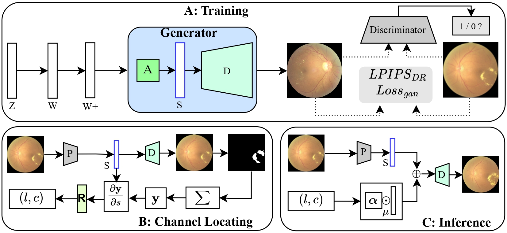

## Label-preserving Data Augmentation in Latent Space for Diabetic Retinopathy Recognition<br><sub>Official PyTorch implementation of the MICCAI 2023 paper</sub>

This paper presents a label-preserving data augmentation method for DR detection using latent space manipulation. The proposed approach involves computing the contribution score of each latent code to the lesions in fundus images, and  manipulating the lesion of real fundus images based on the latent code with the highest contribution score. This allows for a more targeted and effective label-preserving data augmentation approach for DR detection tasks, which is especially useful given the imbalanced classes and limited available data.

## Overview of Method


## Requirements
```bash
python=3.8
pip install -r requirements.txt
```
## Pre-trained models
You can download the pre-trained [stylegan model](https://drive.google.com/file/d/14-Sv793VyBrSD-xXefCMJ_WYgpXIkv35/view?usp=sharing) and [lesion-seg model](https://drive.google.com/file/d/1HKRJ03OccdC_RDwt-TEYPmUxqPm5c7dN/view?usp=sharing), then put them in 'weights' folder.
## Projector
You can project the image into latent codes by:
```
python projector.py --outdir=out --target=fundus.png --network=weights/network.pkl
```
## Run
```python
Run jupyter notebook in script floder
```

## Manipulation Results
[](https://youtu.be/jt8NRZ2PaoE "Image manipulation results")


